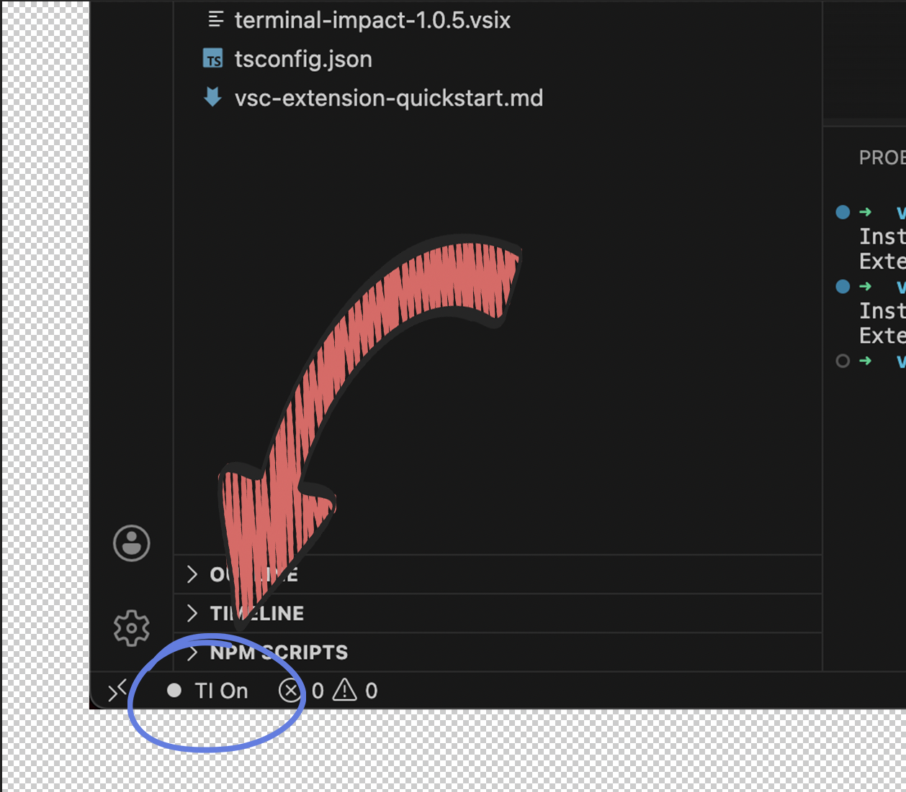

# Terminal Impact

**See what changed. Instantly.**

Terminal Impact adds visual badges to your VS Code Explorer for files created or modified by your tools. Whether it's a CLI command or an AI Agent, never lose track of filesystem changes again.

*Orange diamond badges (◆) appear next to modified files in your Explorer. Click "TI On" in the status bar to toggle the extension.*

## Why use this?

*   **For CLI Users:** You run `rails g model User` or `npm install`. Dozens of files appear. Which ones? This extension lights them up with **orange diamond badges (◆)** in the Explorer.
*   **For AI Users (Cursor / Claude):** AI agents write code fast. Sometimes too fast. Switch to **"Always" mode** to visually track every file the AI touches in real-time. The **diamond icon (◆)** makes it easy to spot changes without conflicting with GitHub's built-in indicators.

## Features

### 🚀 Two Detection Modes
*   **Always (Default):** Highlights *any* file change on disk. Essential when using tools like **Claude Code**, **Cursor**, or external scripts. Works great for manual editing too!
*   **Terminal Only:** Zero noise. The extension *only* highlights files when a terminal command is running. Perfect for keeping focus on CLI-only workflows.

### ⚡️ Instant Visual Feedback
*   **Diamond Badge (◆):** Professional orange diamond appears next to any modified file in the Explorer
*   **Smart Auto-Clear:** Badges automatically disappear when you open the file
*   **Theme-Aware:** Orange color adapts perfectly to both light and dark VS Code themes
*   **No Conflicts:** Diamond icon is distinct from GitHub's circular indicators

### 🎛️ Status Bar Control
Toggle the extension On/Off instantly with a single click in your Status Bar.
*   `TI On` : Extension is watching for file changes
*   `TI Off` : Extension is disabled

---

## Configuration

You can customize everything in your User Settings (`settings.json`):

| Setting | Default | Description |
| :--- | :--- | :--- |
| `terminalImpactHighlighter.triggerMode` | `"always"` | **Crucial Setting.** Use `"always"` (default) to track all file changes. Switch to `"terminalOnly"` for CLI-only workflows. |
| `terminalImpactHighlighter.highlightDurationMs` | `0` | How long (in ms) badges stay visible. `0` means infinite (stays until you open the file). Set to `5000` for 5 seconds auto-clear. |
| `terminalImpactHighlighter.enabled` | `true` | Master switch for the extension. |
| `terminalImpactHighlighter.include` | `["**/*"]` | Glob patterns to watch. |
| `terminalImpactHighlighter.exclude` | `[]` | Glob patterns to ignore. Add patterns like `["**/node_modules/**", "**/.git/**"]` for better performance. |

---

## Commands

*   **Terminal Impact: Toggle Enabled**: Quickly enable/disable the extension (same as clicking the Status Bar item).
*   **Terminal Impact: Clear All Highlights**: Manually remove all current badges from the explorer.

## Installation

1.  Install via VS Code Marketplace.
2.  Reload VS Code.
3.  Run a command in your terminal!

---

**Enjoy coding with clarity!**
